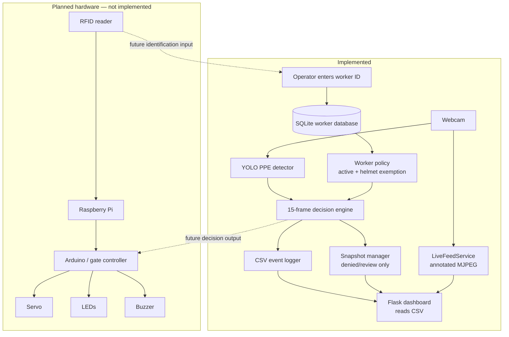
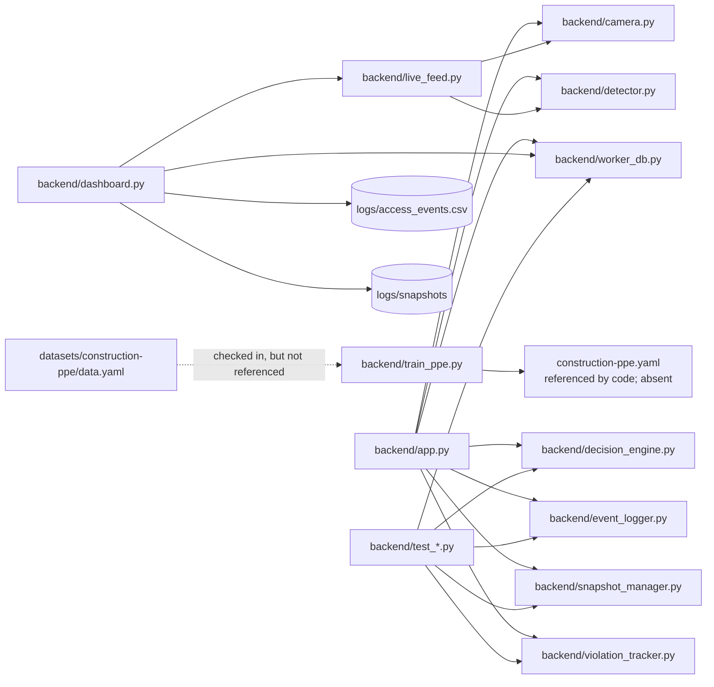
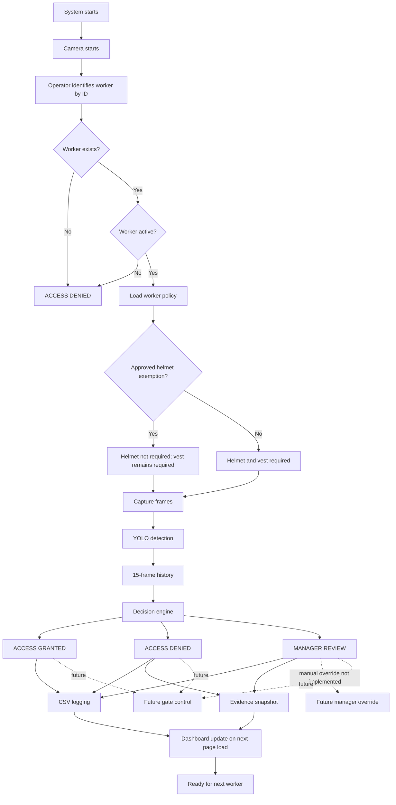

# SafeGate AI

[](https://www.python.org/) [](https://flask.palletsprojects.com/) [](https://www.ultralytics.com/) [](https://opencv.org/)

SafeGate AI is an academic and portfolio prototype for construction-site access screening. It combines a local camera, a trained YOLO PPE model, a policy-aware decision engine and an operator dashboard. The repository also contains a SQLite worker register, CSV event audit trail and evidence snapshots for denied or uncertain automated decisions.

> [!IMPORTANT]
> This is a prototype, not a safety-certified access-control system. It has no implemented gate actuator, RFID reader or manager-override action. Human oversight remains necessary.

## Contents

- [Problem statement](#problem-statement)
- [Solution overview](#solution-overview)
- [Features and status](#features-and-status)
- [Architecture](#architecture)
- [Repository structure](#repository-structure)
- [Getting started](#getting-started)
- [Configuration](#configuration)
- [Usage](#usage)
- [Testing](#testing)
- [Security, ethics and privacy](#security-ethics-and-privacy)
- [Limitations and roadmap](#limitations-and-roadmap)
- [Contributing](#contributing)

## Problem statement

Construction sites need a consistent way to check whether people entering a work area satisfy site PPE policy, while retaining an auditable record of decisions. Manual checks can be difficult to perform consistently at a busy entrance. SafeGate AI explores how local computer vision and worker-held policy data can support that process; it does not replace a site manager or safety procedure.

## Solution overview

The terminal application in `backend/app.py` asks an operator to enter a worker ID, checks the local SQLite record and derives whether a helmet is required from that worker's approved policy. It samples a 15-frame detection history, then issues **ACCESS GRANTED**, **ACCESS DENIED**, or **MANAGER REVIEW**. Non-scanning outcomes are appended to a CSV file; denied and review outcomes also create a JPEG snapshot.

Separately, `backend/dashboard.py` serves a Flask dashboard. Its live-camera service streams annotated YOLO frames as MJPEG and the dashboard reads the CSV log to show recent decisions and snapshot links. At present, the live dashboard stream is **not connected** to worker selection, the decision engine, or event logging.

## Features and status

### AI and computer vision

- Local YOLO inference through Ultralytics using the trained weights at `runs/detect/runs/safegate_ppe/weights/best.pt`.
- OpenCV webcam capture and annotated detection frames.
- YOLO training script configured for 10 epochs, 640px images, batch size 4 and Apple Metal (`device="mps"`).
- Browser-facing MJPEG stream, generated as JPEG frames in a background thread.

### Worker management and decision engine

- SQLite `workers` table with worker ID, name, role, helmet-exemption flag, active flag and notes.
- Worker create, read, update, search, activation and deletion methods, covered by a standalone CRUD script.
- A 15-frame decision window. The default grant and deny thresholds are 10 frames.
- Standard policy requires consistent helmet and vest detections; explicit `no_helmet` or `no_vest` detections can deny access.
- Approved helmet exemption still requires a consistently detected hi-vis vest.

### Dashboard and audit trail

- Flask dashboard with access-event totals, a live feed, camera start/stop endpoints and snapshot serving.
- CSV logging of worker, PPE-frame counts, decision reason and snapshot path.
- JPEG evidence snapshots for denied and manager-review decisions in the terminal workflow.
- Repeat-event warning when a worker reaches three denied/review log entries.

### Hardware

- **Implemented:** webcam input through OpenCV.
- **Planned:** Arduino, Raspberry Pi, servo gate, LEDs, buzzer and RFID. No related source files or hardware-control logic are present.

### Current implementation status

| Component | Status | Evidence and notes |
| --- | --- | --- |
| YOLO PPE detection | Implemented | `detector.py` loads local weights and calls `predict` at confidence 0.25, IoU 0.45 and 640px image size. |
| PPE model weights | Implemented | `best.pt` and `last.pt` are present under `runs/detect/runs/safegate_ppe/weights/`. |
| Camera capture | Implemented | `camera.py` wraps `cv2.VideoCapture`; index 0 is used by the application and dashboard. |
| Stable access decision | Implemented | `decision_engine.py` uses a 15-frame deque and 10-frame grant/deny thresholds. |
| Worker register | Implemented | `worker_db.py` creates and queries the SQLite database, including three demo records. |
| Helmet-exemption policy | Implemented | A stored worker policy controls `helmet_required`; vest detection remains mandatory. |
| Terminal verification workflow | Implemented | `app.py` joins worker selection, detection, policy decision, logging and snapshot capture. |
| CSV audit log and snapshots | Implemented | `event_logger.py` writes CSV; `snapshot_manager.py` writes denied/review JPEGs. |
| Repeat-violation warning | Implemented | `violation_tracker.py` counts denied/review CSV entries against threshold 3. |
| Flask dashboard | Implemented | `dashboard.py` renders dashboard pages, reads log data and serves snapshots. |
| Live MJPEG dashboard stream | Implemented | `live_feed.py` runs a background detector and yields `multipart/x-mixed-replace` JPEG frames. |
| Dashboard worker-management UI | In Progress | `/workers` lists records, but the template states the module will be connected later; no web CRUD routes exist. |
| Dashboard logs, reports, gate and settings | In Progress | Routes render placeholders only. |
| Manager override | In Progress | CSV fields and display conditions exist, but there is no route or function to record an override. |
| Dashboard decision integration | In Progress | The live feed performs detection only; it does not select workers, make access decisions, log events or control gate state. |
| Training configuration | In Progress | `train_ppe.py` references `construction-ppe.yaml`, but the checked-in file is `datasets/construction-ppe/data.yaml`; the script also fixes `device="mps"`. |
| RFID and physical gate control | Planned | No implementation is present. |

## Architecture

### System architecture



The two camera paths are currently separate: the terminal flow performs policy decisions and audit logging; the dashboard flow provides an annotated visual stream.

### Software module architecture



### Worker verification workflow



> [!NOTE]
> Religion is never inferred. There is no facial-recognition or religion-detection code. The exemption route is activated only by a human-managed `helmet_exempt` worker-record policy.

## Repository structure

```text
SafeGate-AI/
├── backend/
│   ├── app.py                  # terminal verification workflow
│   ├── camera.py               # OpenCV camera wrapper
│   ├── dashboard.py            # Flask application and routes
│   ├── live_feed.py            # threaded YOLO MJPEG stream
│   ├── detector.py             # Ultralytics YOLO wrapper
│   ├── decision_engine.py      # frame-history PPE decision policy
│   ├── worker_db.py            # SQLite worker records and CRUD
│   ├── event_logger.py         # CSV event writer
│   ├── snapshot_manager.py     # JPEG evidence writer
│   ├── violation_tracker.py    # repeat-event counter
│   ├── train_ppe.py            # training script (configuration needs alignment)
│   ├── safegate_camera.py      # direct annotated camera demo
│   ├── webcam_test.py          # pretrained-model webcam test
│   └── test_*.py               # executable assertion-based checks
├── frontend/
│   ├── templates/              # Jinja dashboard templates
│   └── static/                 # dashboard CSS and JavaScript
├── data/safegate.db            # SQLite database
├── datasets/construction-ppe/  # checked-in Construction-PPE dataset and YAML
├── logs/                       # CSV audit files and evidence snapshots
├── runs/detect/runs/safegate_ppe/weights/
│   ├── best.pt                 # trained detector used by SafeGate
│   └── last.pt
├── requirements.txt
└── yolo11n.pt                  # pretrained YOLO base model
```

`venv/`, Python caches and training artefacts are intentionally omitted from the tree. The current `.gitignore` excludes `venv/` and `runs/`, although weights are present in this working copy.

## Technology stack

| Area | Technology used |
| --- | --- |
| Application | Python 3.12 (tested), Flask 3.1.3, Jinja2 |
| Vision | Ultralytics 8.4.104, YOLO, OpenCV 5.0.0, PyTorch |
| Data | SQLite (standard library), CSV |
| Front end | HTML, CSS, vanilla JavaScript |
| Training data | Ultralytics Construction-PPE dataset |

## Getting started

### Prerequisites

- Git
- Python 3.12 (the existing environment was tested with 3.12.2)
- A webcam for the live camera commands
- For model training as written, an Apple Silicon/macOS environment with Metal Performance Shaders, because `train_ppe.py` sets `device="mps"`

The checked-in detector weights allow inference without retraining. The `requirements.txt` file pins all runtime packages.

### Clone

**macOS / Linux**

```bash
git clone https://github.com/bhavdeepsingh7-cpu/Safegate-AI.git
cd Safegate-AI
```

**Windows PowerShell**

```powershell
git clone https://github.com/bhavdeepsingh7-cpu/Safegate-AI.git
Set-Location Safegate-AI
```

### Create and activate a virtual environment

**macOS / Linux**

```bash
python3.12 -m venv venv
source venv/bin/activate
python -m pip install --upgrade pip
pip install -r requirements.txt
```

**Windows PowerShell**

```powershell
py -3.12 -m venv venv
.\venv\Scripts\Activate.ps1
python -m pip install --upgrade pip
pip install -r requirements.txt
```

> [!TIP]
> All commands below assume the virtual environment is active and are run from the repository root. On macOS or Linux, substitute `venv/bin/python` for `python` if you do not activate it.

### Run the available applications

| Purpose | Command | Notes |
| --- | --- | --- |
| Terminal verification workflow | `python backend/app.py` | Enter a demo worker ID when prompted; press `Q` in the OpenCV window to quit. |
| Flask dashboard | `python backend/dashboard.py` | Browse to `http://127.0.0.1:5000`; the page requests the live stream automatically. |
| Direct trained-model camera demo | `python backend/safegate_camera.py` | Uses `best.pt` and webcam index 0. |
| Pretrained-model webcam test | `python backend/webcam_test.py` | Uses `yolo11n.pt`, not the PPE weights. |
| YOLO loading check | `python backend/test_yolo.py` | Loads `yolo11n.pt`. |
| Training script | `python backend/train_ppe.py` | **Currently requires configuration correction**; see [Training](#training). |

### Training

`backend/train_ppe.py` is an in-progress training entry point. It starts from `yolo11n.pt`, requests 10 epochs and writes results to `runs/safegate_ppe`, but it passes `data="construction-ppe.yaml"`. No file with that name exists: the repository contains `datasets/construction-ppe/data.yaml`. Its YAML uses a relative `path: construction-ppe`, so it must also be resolved from an appropriate working directory or changed to an absolute/repository-relative path. The script should not be treated as runnable without that adjustment.

Its current command is nevertheless:

```bash
python backend/train_ppe.py
```

## Configuration

Configuration is currently hard-coded rather than environment-driven.

| Setting | Value in source | Location |
| --- | --- | --- |
| PPE model path | `runs/detect/runs/safegate_ppe/weights/best.pt` | `app.py`, `safegate_camera.py`; dashboard builds the absolute equivalent |
| Base model path | `yolo11n.pt` | `train_ppe.py`, `webcam_test.py`, `test_yolo.py` |
| Camera index | `0` | `app.py`, `dashboard.py`, `safegate_camera.py`, `webcam_test.py` |
| Inference confidence | `0.25` | `app.py`, dashboard live-feed service |
| Direct-demo confidence | `0.40` | `safegate_camera.py` |
| Inference IoU | `0.45` | `detector.py` |
| Inference image size | `640` | `detector.py` |
| History size | `15` frames | `app.py`, `decision_engine.py` default |
| Grant / deny thresholds | `10` frames each | `app.py`, `decision_engine.py` default |
| Worker database | `data/safegate.db` | `worker_db.py`; dashboard uses absolute project path |
| Event log | `logs/access_events.csv` | `event_logger.py`; dashboard uses absolute project path |
| Snapshot root | `logs/snapshots` | `snapshot_manager.py`; dashboard uses absolute project path |
| Repeat-event threshold | `3` denied/review events | `app.py`, `violation_tracker.py` default |
| Flask host / port | `127.0.0.1:5000` | `dashboard.py` |

To use another camera or model, change the relevant source constant/constructor argument. No `.env` or command-line configuration layer is implemented.

## Usage

1. Activate the virtual environment and confirm `runs/detect/runs/safegate_ppe/weights/best.pt` is present.
2. Run `python backend/app.py` for the end-to-end terminal workflow.
3. Enter `1001` for an active demo worker with a stored helmet exemption, `1002` for standard PPE policy, or `1003` to see inactive access denied. These records are inserted if absent when `WorkerDatabase` opens.
4. Present the relevant PPE to camera index 0. The engine first returns `SCANNING` until it has 15 frames.
5. Read the on-frame status. A standard worker is granted only when helmet and vest meet the policy thresholds; unclear results go to manager review.
6. Inspect `logs/access_events.csv`. Denied and review outcomes have JPEG evidence under `logs/snapshots/<YYYY-MM-DD>/<status>/`.
7. Optionally run `python backend/dashboard.py` and open the local URL. It displays the log data and live annotated feed; refresh the page to see newly written terminal events.

### Helmet exemption design

The stored `helmet_exempt` field is an approved, site-specific policy setting. It is not generated by the camera or detector. When the field is true, the decision engine does not require a helmet detection but still requires a vest. The demonstration record notes an approved Sikh safety-helmet exemption, but the model makes no religious inference and contains no facial-recognition code. A production deployment should provide human approval, review, expiry and governance of policy records.

## Testing

The project uses executable Python scripts with assertions rather than a pytest suite. From the repository root, run:

```bash
python backend/test_decision_engine.py
python backend/test_system.py
python backend/test_worker_crud.py
python backend/test_worker_db.py
python backend/test_yolo.py
```

The first four scripts were run successfully in the repository’s Python 3.12.2 virtual environment during this documentation audit. `test_yolo.py` was not run here because it loads a model and can initialise the Ultralytics runtime; it only checks that `yolo11n.pt` can be loaded. No camera-based test was executed because it needs physical webcam access.

| Script | What it checks |
| --- | --- |
| `test_decision_engine.py` | Standard grant, standard denial and manager-review outcomes after 15 synthetic frames. |
| `test_system.py` | Demo worker flags; standard and exemption decision paths; manager review; log/snapshot/tracker initialisation. |
| `test_worker_crud.py` | Create, duplicate protection, update, search, deactivate/reactivate and delete on a temporary SQLite database. |
| `test_worker_db.py` | Lists demo workers and asserts the record for ID `1001`. |
| `test_detector.py` | Attempts to instantiate the PPE detector; it prints a missing-model error rather than asserting it. |
| `test_yolo.py` | Loads the base YOLO model. |

> [!CAUTION]
> Running `test_system.py` creates `logs/test_access_events.csv` and `logs/test_snapshots/`; `test_worker_crud.py` creates then removes `data/test_worker_crud.db`. These are expected test side effects.

## Security, ethics and privacy

### Security

- The dashboard binds to `127.0.0.1`, but it has no authentication, authorisation, CSRF protection or role management.
- Worker names, roles, access records and image evidence are stored locally in SQLite, CSV and JPEG files without encryption or retention controls.
- Snapshot paths are constrained to the configured snapshot root before Flask serves them, but access is otherwise unauthenticated.
- Do not expose this dashboard to a network or use it as the sole gate control without addressing these controls.

### Ethics and privacy

- PPE detection can be wrong, especially under occlusion, difficult lighting, poor framing or classes outside the model's training distribution.
- Automated outcomes should be reviewed by an accountable person, particularly `MANAGER REVIEW` and denied outcomes.
- The exception policy is an explicit worker-record setting, not a judgement inferred from appearance, religion or biometric identity.
- Collect only data needed for the purpose, set retention and access rules, provide appropriate notices and follow the applicable institutional and legal requirements before deployment.

## Limitations and roadmap

### Current limitations

- The dashboard's stream is not an access-verification session and is not linked to worker IDs, decision-making, snapshots or log writes.
- There is no web UI for worker CRUD, log search, reports, settings, gate control or manager override; corresponding dashboard pages are placeholders.
- The event CSV has override columns, but no implementation writes override values.
- The detector extracts classes for boots, gloves and goggles, but access decisions only use helmet and vest states.
- Camera/model/configuration failures are reported at runtime; no structured configuration, authentication or deployment setup exists.
- Training is not currently reproducible from the supplied script because its dataset YAML path does not match the checked-in file, and it is tied to MPS.
- There is no hardware integration, RFID identification, automated gate actuation or safety interlock.

### Roadmap

**Completed**

- [x] Local YOLO PPE inference and OpenCV camera capture
- [x] SQLite worker policy and terminal verification
- [x] Frame-history decision engine, CSV events and evidence snapshots
- [x] Flask dashboard and annotated MJPEG stream

**Current**

- [ ] Connect dashboard worker/session state to the decision engine and event pipeline
- [ ] Complete the dashboard worker, logs, reports, gate and settings pages
- [ ] Align and validate the training dataset configuration
- [ ] Implement an auditable human manager-override workflow

**Planned**

- [ ] Add RFID-based worker identification
- [ ] Add secure authentication, authorisation, retention and audit controls
- [ ] Add Arduino/Raspberry Pi gate-control interfaces, actuator feedback and fail-safe design
- [ ] Introduce automated tests, CI and reproducible training/evaluation reporting

## Contributing

1. Fork the repository and create a focused branch.
2. Make a small, documented change with tests appropriate to the component.
3. Run the relevant commands in [Testing](#testing).
4. Clearly describe behavioural changes, hardware assumptions and any data/privacy impact in the pull request.

When changing PPE policy, model weights or worker-data handling, include a human-review and safety rationale. Do not represent a planned hardware or dashboard capability as implemented.

## Licence

No open-source licence has currently been added.

## Author

**Bhavdeep Singh** — [GitHub profile](https://github.com/bhavdeepsingh7-cpu)

SafeGate AI is an academic and portfolio project.

## Acknowledgements

- [Flask](https://flask.palletsprojects.com/) for the dashboard framework.
- [Ultralytics](https://www.ultralytics.com/) for YOLO tooling and the Construction-PPE dataset configuration included in this repository.
- [OpenCV](https://opencv.org/) for camera access, image annotation and snapshot encoding.
- [SQLite](https://www.sqlite.org/) for the embedded worker register.
